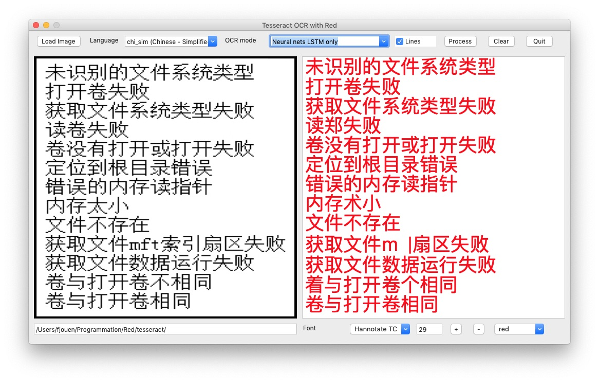

#Deep Learning Text Recognition (OCR) using Tesseract and Red

I'm frequently using OCR Tesseract when I have to recognize text in images. 
Tesseract was initially developed  by Hewlett Packard Labs. In 2005, it was open sourced by HP, and since 2006 it has been actively developed by Google and open source community.

In version 4, Tesseract has implemented a long short term memory (LSTM) recognition engine which is a kind of recurrent neural network (RNN) very efficient for OCR.

Tesseract library includes a command line tool *tesseract* which can be used  to perform OCR on images and output the result in a text file.

## Install Tesseract
First of all you need to install Tesseract library accoding to your main OS such as *sudo apt install tesseract-ocr* for Linux or  *brew install tesseract* for macOS. 

If you want multi-language support (about 170 languages) you have to install *tesseract-lang* package. 

## Using Tesseract with Red Language

This operation is really trivial since Red includes a *call* fonction which makes possible to use tesseract command line tool. You have to use call/wait refinment in order to wait tessearact execution. You can use different languages according to your documents.

## Code Sample
```
see tesseract.red
```


## Result

This an example for simplified chinese document. 




 

